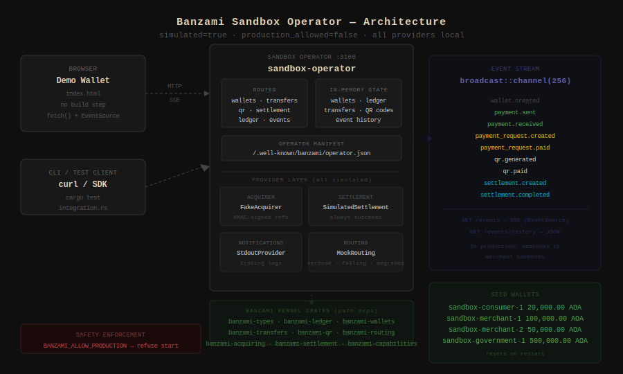

# Banzami

**The open financial infrastructure core for programmable instant payments in Angola.**

> "O Banzami constrói a infraestrutura. O Banza é o primeiro produto construído sobre ela."  
> "Banzami builds the infrastructure. Banza is the first product built on top of it."

---

## Start here — run the sandbox

Before touching any crate, reading any ADR, or building any integration:
**run the sandbox operator**.

```bash
git clone https://github.com/banzami/banzami
cd banzami/reference
cargo run --bin sandbox-operator
```

Then open `reference/demo-wallet/index.html` in your browser.

In five minutes you will have executed real wallet transfers, QR payments,
payment requests, settlement batches, and a live event stream — all against
the Banzami financial kernel, with zero cloud infrastructure.

```bash
# Verify the kernel is running
curl http://localhost:3100/health

# Send your first transfer
curl -X POST http://localhost:3100/transfers \
  -H 'Content-Type: application/json' \
  -d '{"from_wallet_id":"sandbox-consumer-1","to_wallet_id":"sandbox-merchant-1","amount_minor":50000,"currency":"AOA"}'
```

Full walkthrough: [`docs/getting-started.md`](docs/getting-started.md)  
Full API reference: [`docs/reference-api.md`](docs/reference-api.md)  
OpenAPI spec: [`contracts/openapi/reference-operator.yaml`](contracts/openapi/reference-operator.yaml)

---

## What is Banzami?

Banzami is the **open-source financial infrastructure kernel** that operators, developers, and fintech builders use to create instant, wallet-native payment networks.

Like Linux for operating systems, like Kubernetes for container orchestration, like PostgreSQL for databases — Banzami is the open foundation that any financial operator can deploy, extend, and build on.

Banzami provides:

- **Financial core crates** (Rust) — double-entry ledger, wallet engine, transaction FSM, settlement, reconciliation, routing, acquiring abstraction, QR runtime, identity
- **Protocol specifications** — QR payload format, webhook schemas, OpenAPI contracts, event schemas
- **Official SDKs** — TypeScript, Python, PHP, Go, Flutter
- **Integration plugins** — WooCommerce, Shopify, Laravel, Node.js, PHP
- **SDK certification** — test vectors and compliance suite for third-party implementations
- **Architecture documentation** — ADRs, domain models, design principles, sandbox environment

---

## What is Banza?

**Banza is the first commercial operator and product built on Banzami.**

Banza is Angola's instant payment and wallet network — the consumer app, merchant dashboard, QR infrastructure, and payment experience. Banza uses Banzami core crates, conforms to Banzami contracts, and implements Banzami SDKs.

Banza is to Banzami what:
- Ubuntu is to the Linux kernel
- Google Kubernetes Engine is to Kubernetes
- Samsung One UI is to Android AOSP
- A managed Postgres service is to PostgreSQL

The public/private split is **not** language-based. It is:

| Public — Banzami | Private — Banza |
|---|---|
| Generic financial infrastructure | Operator-specific business logic |
| Ledger, wallets, routing, QR engine | EMIS/Multicaixa provider adapters |
| Transaction FSM, settlement model | Production compliance rules |
| SDKs, contracts, protocol specs | Consumer/merchant apps |
| Certification test vectors | Production deployment + infra |
| Reference sandbox | Fraud scoring heuristics |

---

## Ecosystem architecture

```
                    ┌─────────────────────────────┐
                    │          BANZAMI             │
                    │   Open Financial Kernel      │
                    │   Protocol · Core · SDKs     │
                    └─────────────────────────────┘
                                  │
        ┌─────────────────────────┼─────────────────────────┐
        ▼                         ▼                         ▼
 ┌────────────┐          ┌──────────────┐          ┌──────────────┐
 │  Rust Core │          │  Contracts   │          │  SDKs /      │
 │            │          │              │          │  Integrations│
 │  ledger    │          │  OpenAPI     │          │              │
 │  wallets   │          │  Webhooks    │          │  TypeScript  │
 │  qr        │          │  QR spec     │          │  Python      │
 │  routing   │          │  Events      │          │  PHP / Go    │
 │  acquiring │          │  Cert suite  │          │  Flutter     │
 │  ...       │          │              │          │  WooCommerce │
 └────────────┘          └──────────────┘          └──────────────┘
                                  │
                                  ▼
                    ┌─────────────────────────────┐
                    │            BANZA             │
                    │  First Commercial Operator   │
                    │                             │
                    │  Consumer app · Merchant app │
                    │  EMIS/Multicaixa adapters   │
                    │  Production infra · Ops     │
                    │  Compliance · Risk rules    │
                    └─────────────────────────────┘
```

---

## Repository structure

```
banzami/
├── core/                   Open-source Rust financial infrastructure
│   ├── Cargo.toml          Workspace root
│   ├── crates/
│   │   ├── banzami-types/          Money, Currency, typed IDs
│   │   ├── banzami-ledger/         Double-entry ledger engine
│   │   ├── banzami-wallets/        Merchant wallet engine
│   │   ├── banzami-consumer-wallets/ Consumer wallet engine
│   │   ├── banzami-transactions/   Transaction lifecycle
│   │   ├── banzami-transfers/      P2P wallet transfers
│   │   ├── banzami-qr/             QR code runtime
│   │   ├── banzami-payment-links/  Payment link engine
│   │   ├── banzami-merchants/      Merchant onboarding
│   │   ├── banzami-identity/       @handle identity
│   │   ├── banzami-routing/        Payment rail routing
│   │   ├── banzami-acquiring/      Acquiring abstraction
│   │   ├── banzami-settlement/     Settlement lifecycle
│   │   ├── banzami-reconciliation/ Statement reconciliation
│   │   ├── banzami-risk/           Risk limit framework
│   │   ├── banzami-compliance/     KYC/KYB tracking
│   │   └── banzami-payouts/        Outbound disbursements
│   └── README.md
├── contracts/              Protocol contracts (canonical specs)
│   ├── openapi/            REST API specifications
│   ├── webhooks/           Webhook payload schemas
│   ├── qr/                 QR payload format specification
│   ├── events/             Event schemas
│   └── sdk-certification/  SDK compliance test vectors
├── sdk/                    Official Banzami SDKs
│   ├── typescript/         @banza/sdk
│   ├── python/             banza-python
│   ├── php/                banza/sdk-php
│   ├── go/                 banza-go
│   └── checkout-web/       Browser checkout embed
├── integrations/           Commerce and framework integrations
│   └── plugins/
├── sdk-certification/      Certification test suite and vectors
├── reference/              Local development sandbox (no external infra)
│   ├── sandbox-operator/   In-memory HTTP server on :3100
│   ├── fake-acquirer/      Simulated AcquirerProvider (HMAC-signed, no bank)
│   ├── local-notifications/ StdoutNotificationProvider + NullNotificationProvider
│   ├── simulated-settlement/ SettlementExecutionProvider (always succeeds)
│   └── docker-compose.yml  One-command startup
├── docs/                   Public documentation
│   ├── adr/                Architecture Decision Records
│   ├── architecture/       System design principles
│   ├── core/               Domain documentation (ledger, wallets, QR, ...)
│   └── ...
└── examples/               Reference integrations
```

---

## Sandbox architecture



The sandbox operator wires the Banzami kernel crates together with four simulated
providers (FakeAcquirer, SimulatedSettlement, StdoutNotifications, MockRouting)
and exposes a REST API + SSE event stream on `:3100`. No external services required.

---

## Financial core — quick start

The core is a Rust workspace. Each crate is independently usable.

```toml
[dependencies]
banzami-types  = { git = "https://github.com/banzami/banzami" }
banzami-ledger = { git = "https://github.com/banzami/banzami" }
```

Core financial operation — double-entry ledger transfer:

```rust
use banzami_types::{Money, Currency};
use banzami_ledger::PostingBuilder;

let amount = Money::new(100_000, Currency::AOA); // 1000.00 AOA

let posting = PostingBuilder::new()
    .debit(consumer_account_id, amount.clone())
    .credit(merchant_account_id, amount)
    .idempotency_key("txn_xyz_20260528")
    .build()?;

ledger_engine.post(posting).await?;
```

See [`core/README.md`](core/README.md) for full documentation.

---

## Local sandbox — full feature set

The sandbox operator is the **official local development target** for Banzami.
Run it before touching any kernel crate or building any integration.

```bash
cd reference && cargo run --bin sandbox-operator
# Then: open reference/demo-wallet/index.html
```

**What the sandbox provides:**

| Feature | Endpoint | Status |
|---------|----------|--------|
| Wallet management | `GET/POST /wallets` | Stable |
| P2P transfers (double-entry) | `POST /transfers` | Stable |
| Payment requests (pull payments) | `POST /payment-requests` | Stable |
| QR payment flow | `POST /qr` | Stable |
| Ledger inspection | `GET /ledger/{id}` | Stable |
| Settlement simulation | `POST /settlement/batches` | Stable |
| Live event stream (SSE) | `GET /events` | Stable |
| Operator manifest | `GET /.well-known/banzami/operator.json` | Experimental |

```bash
# Health check
curl http://localhost:3100/health

# Transfer
curl -X POST http://localhost:3100/transfers \
  -H 'Content-Type: application/json' \
  -d '{"from_wallet_id":"sandbox-consumer-1","to_wallet_id":"sandbox-merchant-1","amount_minor":50000,"currency":"AOA"}'

# Watch events live
curl -N http://localhost:3100/events
```

Full docs: [`docs/reference-operator.md`](docs/reference-operator.md) ·
[`docs/reference-api.md`](docs/reference-api.md) ·
[`contracts/openapi/reference-operator.yaml`](contracts/openapi/reference-operator.yaml)

---

## SDKs — quick start

```ts
import { BanzaClient } from '@banza/sdk';

const banza = new BanzaClient({ apiKey: 'sk_sandbox_...', environment: 'sandbox' });

const qr = await banza.qr.generate({
  merchant_id: 'merch_...',
  amount_minor: 50000,  // 500.00 AOA
  currency: 'AOA',
});
```

See [`sdk/`](sdk/) for all languages.

---

## Payment model

Banzami is wallet-native. The canonical operation:

```
Consumer Wallet  ──ledger transfer──▶  Merchant Wallet
```

All surfaces derive from it: QR, @handle, pay links, checkout. Reference models: Pix, UPI, M-Pesa — not card-first.

---

## Contracts

All payment protocol specifications live in [`contracts/`](contracts/):

- [OpenAPI specs](contracts/openapi/) — REST API definitions
- [Webhook schemas](contracts/webhooks/) — event payload format and signature spec
- [QR payload format](contracts/qr/) — QR code content specification
- [SDK certification](contracts/sdk-certification/) — compliance test suite

---

## Financial invariants

Every core crate enforces:

- **Double-entry**: every ledger posting sums to zero
- **Immutability**: ledger entries are append-only
- **No negative balance**: wallet available balance cannot go below zero
- **Idempotency**: same key, same result — always
- **Atomicity**: balance changes are transactional

---

## Governance

Protocol changes (contracts, QR spec, webhook schemas) require an Architecture Decision Record and a minimum 7-day review period. See [GOVERNANCE.md](GOVERNANCE.md).

---

## Contributing

See [CONTRIBUTING.md](CONTRIBUTING.md). Contributions welcome to:

- Core Rust crates (ledger, wallets, QR, routing, etc.)
- SDKs (TypeScript, Python, PHP, Go, Flutter)
- Contracts (OpenAPI, webhook schemas, QR spec)
- Integrations (plugins, adapters)
- Documentation and examples

**New contributors:** start with [`docs/getting-started.md`](docs/getting-started.md)
and [`docs/contributor-journeys.md`](docs/contributor-journeys.md).  
**Understand what is stable:** [`docs/stability.md`](docs/stability.md)

---

## Security

Report vulnerabilities to [security@banzami.org](mailto:security@banzami.org). Do not open public issues. See [SECURITY.md](SECURITY.md).

---

## License

- Core crates and contracts: [Apache 2.0](LICENSE)
- SDKs: [Apache 2.0](LICENSE)
- Examples: MIT
- Documentation: Creative Commons CC BY 4.0

---

## Related

- **Banza** — first commercial operator (`github.com/banzami/banza`, private)
- **banzami.org** — public documentation and ecosystem reference
